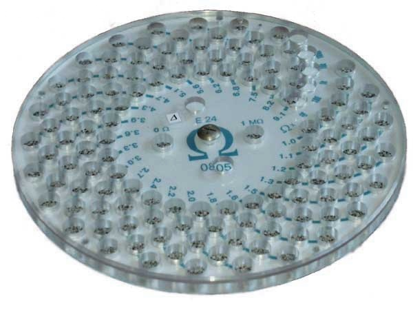

Resistors-Box
=============

A utility for creating a box for SMD resistors or radio components.
Helps create an SVG file to create CNC machine paths to cut out that part.
It also creates a PNG image for clarity and understanding of what the result will be.

Written in the Processing.

## Example PNG

	

## What it might looks like

	

	

